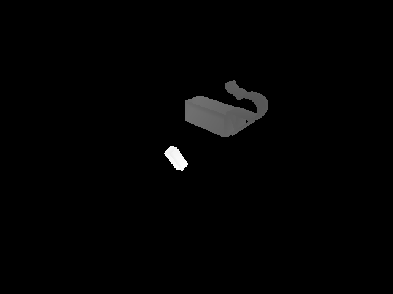
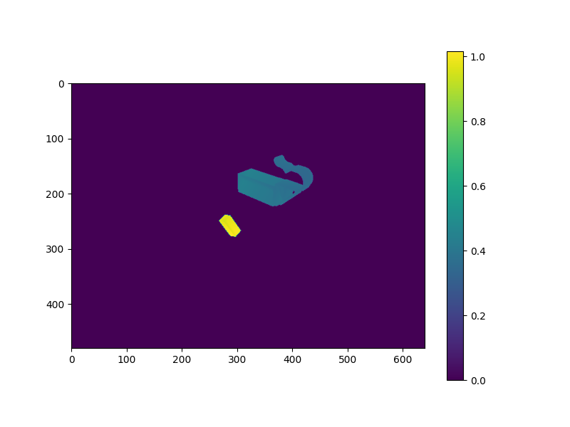
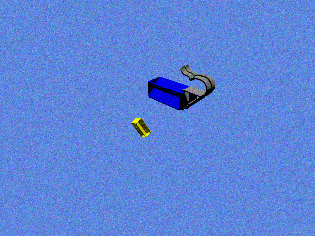

# Dataset Generator from 3D Models

Dự án này tạo ra một tập dữ liệu hình ảnh từ các mô hình 3D. Chương trình sử dụng các thư viện như `trimesh`, `pyrender`, và `numpy` để tải, biến đổi và render các mô hình 3D thành các hình ảnh 2D.

## DEMO

<!-- add image from resources folder -->

