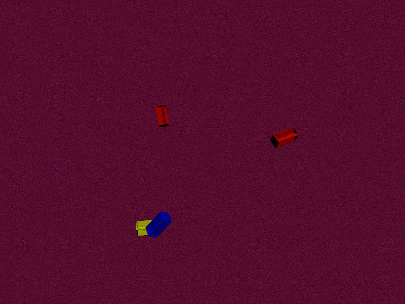

# Dataset Generator from 3D Models

Dự án này tạo ra một tập dữ liệu hình ảnh từ các mô hình 3D. Chương trình sử dụng các thư viện như `trimesh`, `pyrender`, và `numpy` để tải, biến đổi và render các mô hình 3D thành các hình ảnh 2D trong nhiều môi trường và tình huống khác nhau. Ngoài ra còn có tính năng tự động gắn nhãn tại vị trí của mô hình.

Hiện tại hỗ trợ các tính năng chính sau:
- Load và merge các mô hình 3D từ định dạng (.obj), xem tại `SceneGenerator._load_meshes`.
- Áp dụng các biến đổi ngẫu nhiên (scale, rotation, translation) cho mô hình, xem hàm `SceneGenerator.apply_random_transformations`.
- Tạo scene mới với số lượng mô hình tùy chọn, thêm ánh sáng, và thiết lập camera tối ưu, xem `SceneGenerator.generate_scene`.
- Render scene và xử lý ảnh, tạo background ngẫu nhiên, thêm độ nhiễu và điều chỉnh độ sáng/tương phản tại `DatasetGenerator.render_scene` và `DatasetGenerator.add_noise_and_augmentation`.
- Tính toán và vẽ bounding boxes cho từng mô hình 3D, xem `DatasetGenerator._calculate_2d_obb` và `DatasetGenerator._draw_box`.
- Tạo dữ liệu gắn nhãn tự động theo chuẩn COCO JSON với class `COCODatasetGenerator`, bao gồm chuyển đổi bbox sang format COCO và lưu annotations.

## DEMO

| Hình ảnh được tạo | Hình ảnh đã gắn nhãn |
|------------|------------------|
|  |  |
|  |  |